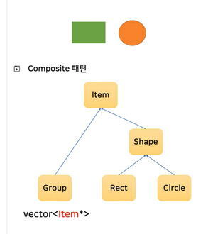

### Design Pattern
- Design Pattern 이란? 자주 사용하는 코딩 패턴에 이름을 부여 한 것

- Protected constructor
    ```cpp
    class Animal
    {
    protected:
        Animal() {}
    };

    class Dog : public Animal
    {
    public:
        Dog() {}    //Dog() : Animal() {}
    };

    int main()
    {
        Animal a;   // error.
        Dog    d;   // ok
    }
    ```
    > Dog의 생성자가 먼저 호출 되고 생성자의 안에서 기반 클래스인 Animal의 생성자를 호출한다.

    > 생성자를 protected에 만드는 이유
    > - 자기자신은 객체로 만들 수 없으나 파생 클래스의 객체는 만들수 있도록 하기 위해
    > - 즉, 추상적인 개념은 객체로 존재 할 수 없으나 현실세계에서 객체가 존재 하는 경우

- protected destructor
    ```cpp
    class Car
    {
    public:
        Car() {}
        void Destory() { delete this; }
    protected:
        ~Car() { std::cout << "~Car" << std::endl; }
    };

    int main()
    {
        //Car c;          // 스택에 객체를 만들 수 없다.
        Car* p = new Car; // 힙에는 객체를 만들 수 있다.
        //delete p;       // protected에 접근 불가하여 error
        p->Destroy();     // 멤버함수를 이용하여 객체 파괴
    }
    ```
    > 객체를 스택에 만들지 못하게 하는 기법  
    > 참조계수 기반의 객체 수명 관리 기법에서 주로 사용

- Upcasting
    ```cpp
    class Animal
    {
        int age;
    public:
        virtual void Cry() { std::cout << "Animal Cry" << std::endl; }
    };

    class Dog : public Animal
    {
        int color;
    public:
        //override
        virtual void Cry() override { std::cout << "Dog Cry" << std::endl; }    //override생략 가능하지만 오타 방지를 위해 붙이는 것이 좋은 습관!
    };

    int main()
    {
        Dog d;

        Dog*    p1 = &d;    // ok
        double* p2 = &d;    // error
        Animal* p3 = &d;    // ok

        p3->Cry();      // Dog Cry 출력, 
                        // vertual이 아닐 경우 Animal Cry 출력 
    }
    ```
    > 기반 클래스의 타입의 포인터(참조)로 파생 클래스 객체를 가리킬 수 있다.

    > 파생클래스가 재정의(override) 한 함수가 호출되게 하려면 반드시 가상함수(virtual)로 만들어야 한다.

    - Upcasting 사용 예
    > 
