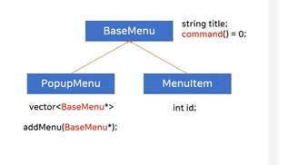

## Design Pattern part3

- Composite 패턴을 활용한 메뉴 만들기
    - 객체들을 트리구조로 구성하여 부분과 전체를 나타내는 계층구조로 만드는 것
    - 개별 객체와 복합 객체를 구별하지 않고 동일한 방법으로 다룬다.(command 함수)
    - 일부 파생클래스에만 필요한 함수에 경우 기반클래스에 구현하고 비정상 리턴 혹은 throw를 던지도록 한다.

    
    
    
    
    ```cpp
    #include <iostream>
    #include <string>
    #include <vector>

    using namespase std;

    class BaseMenu
    {
        string title;
    public:
        BaseMenu(string s) : title(s) {}
        string getTitle() const { return title; }
        virtual void command() = 0;
        virtual BaseMenu* getSubMenu(int idx) { return 0; }
        virtual void addMenu(BaseMenu* p) { throw "unsupported function..."; }
    };

    class MenuItem : public BaseMenu
    {
        int id;
    public:
        MenuItem(string s, int n) : BaseMenu(s), id(n) {}   // 기반클래스의 디폴트 생성자가 없을 경우 
                                                            // 파생클래스 생성자에서 기반클래스 생성자를 호출 해야 한다.
        virtual void command() override
        {
            cout << getTitle() << endl;
            // menu의 event를 처리하는 방법
            //  1. template method : event 종류 마다 퍄생 class가 생성 되는 단점
            //  2. strategy pattern(Listener) : event마다 switch case의 분기가 증가되는 단점 
            //  3. 2번의 방법을 개선하여 객체가 아닌 함수를 연결 한다. (범용)함수 포인터 사용
        }
    };

    class PopupMenu : public BaseMenu
    {
        vecotr<BaseMenu*> v;
    public:
        //PopupMenu(string s) : BaseMenu(s) {}
        using BaseMenu::BaseMenu;   // 생성자 상속
        void addMenu(BaseMenu* p) { v.push_back(p); }

        void command()
        {
            system("cls");

            int sz = v.size();
            
            for (int i = 0; i < sz; i++)
            {
                cout << i +1 << ". " << v[i]->getTitle() << endl;
            }

            cout << sz + 1 << ". 상위 메뉴로" << endl;

            int cmd;
            cout << "메뉴를 선택하세요 >> ";
            cin >> cmd;

            if ( cmd < 0 || cmd > sz + 1)   // 예외 처리
                continue;

            if ( cmd == sz + 1) // 상위 메뉴로 선택
                break;

            // 선택된 메뉴 실행
            v[cmd-1]->command();    // 핵심 : 다형성
        }

        BaseMenu* getSubMenu(int idx)
        {
            return v[idx];
        }
    };

    int main()
    {
        //MenuItem("sound", 11);
        // 메뉴 구성
        PopupMenu* menubar = new PopupMenu("menubar");
        PopupMenu* pm1 = new PopupMenu("화면 설정");
        PopupMenu* pm2 = new PopupMenu("소리 설정");
        MenuItem* m1 = new MenuItem("정보 확인", 11);

        menubar->addMenu(pm1);
        menubar->addMenu(pm2);
        menubar->addMenu(m1);

        pm1->addMenu(new MenuItem("해상도 변경", 21));
        pm1->addMenu(new MenuItem("명암 변경", 22));

        pm2->addMenu(new MenuItem("음량 조절", 31));

        // getSubMenu라는 기능을 추가 한다고 했을때 PopupMenu클래스에서만 필요하지만 
        // BaseMenu로 return된 객체에서 다시 사용하기 위해서는 기반클래스에도 정의가 필요하다.
        // menubar->getSubMenu(1)의 return type은 BaseMenu이다.
        BaseMenu* p = menubar->getSubMenu(1)->getSubMenu(0);

        // addMenu 함수의 유연성을 위해 BaseMenu class에도 구현이 필요하다.
        menubar->getSubMenu(1)->addMenu(new MenuItem("AAA", 100));

        // 시작
        menubar->command();
        return 0;
    }
    ```
    ```cpp
    /*template method*/
    class MenuItem : public BaseMenu
    {
        int id;
    public:
        MenuItem(string s, int n) : BaseMenu(s), id(n) {}   
        virtual void command() override
        {
            cout << getTitle() << endl;
            doCommand();
        }
        virtural void doCommand();
    };

    class viewInfo : public MenuItem
    {
    public:
        using MenuItem::MenuItem;
        virtual void doCommand()
        {
            cout << "LG Electronics" << endl;
        }
    };

    int main()
    {
        viewInfo m1("정보 확인", 11);
        m1.command();
    }
    ```

    ```cpp
    /*Listener*/
    struct IMenuListener
    {
        virtual void doCommand(int id) = 0;
        virtual ~doCommand() {}
    };

    class MenuItem : public BaseMenu
    {
        int id;
        IMenuListener* pListener = 0;
    public:
        void setListener(IMenuListener* p) { pListener = p; }
        MenuItem(string s, int n) : BaseMenu(s), id(n) {}   
        virtual void command() override
        {
            cout << getTitle() << endl;
            if ( pListener != 0)
                pListener->doCommand(id);
        }
    };

    class Display : public IMenuListener
    {
        virtual void doCommand(int id)
        {
            switch(id)
            {
            case 21: cout << "21" << endl; break;
            case 22: cout << "22" << end; break;
            default: break;
            }
        }
    };

    int main()
    {
        Display d;
        MenuItem m1("해상도 변경", 21);
        MenuItem m2("명암 변경", 22);
        m1.setListener(&d);
        m2.setListener(&d);

        m1.command();   // 21출력
        m2.command();   // 22출력
    }
    ```

    ```cpp
    /*function*/
    #include <functional>

    class MenuItem : public BaseMenu
    {
        int id;
        function<void()> handler;
    public:
        void setHandler(function<void()> h) { handler = h; }
        MenuItem(string s, int n) : BaseMenu(s), id(n) {}   
        virtual void command() override
        {
            cout << getTitle() << endl;
            handler();
        }
    };

    int main()
    {
        MenuItem m1("음량 조절", 31);
        m1.setHander([]() { cout << "volume up" << endl; });
        m1.command();
    }
    ```

- 범용 함수 포인터
    - 일반 함수 포인터와 멤버함수 포인터를 동일한 모양의 type으로 받을 수 있도록 하는 방법
    ```cpp
    int main()
    {
        void(*f1)() = &foo;
        void(Dialog::*f2)() = &Dialog::Close();
    }
    ```
    > 좌변의 type을 동일 하게 사용할 수 있도록 하는 방법이다.
    
    

    ```cpp
    void foo() { cout << "foo" << endl; }

    class Dialog
    {
    public:
        void Close() { cout << "Dialog::Close" << endl; }
    };

    struct IAction
    {
        virtual void Execute() = 0;
        virtual ~IAction() {}    
    };

    class FunctionAction : public IAction
    {
        typedef void(*FP)();
        FP handler;
    public:
        FunctionAction(FP f) : handler(f) {}
        virtual void Execute() override { handler(); }
    }

    template<typename T>
    class MemberAction : public IAction
    {
        typedef void(T::*FP)();
        FP handler;
        T* target;
    public:
        MemberAction(FP f, T* obj) : handler(f), target(obj) {}
        virtual void Execute() override { (target->*handler)(); }   // ??
    };

    // 클래스의 함수 템플릿 만들기
    template<typename T>
    MemberAction* action(void(T::*f)(), T* obj)
    {
        return new MemberAction<T>(f, obj);
    }

    // 일관성을 유지하기 위해 FunctionAction class의 action함수를 만든다.
    FunctionAction* action(void(*f)())
    {
        return new FunctionAction(f);
    }

    int main()
    {
        Dialog dlg;

        //IAction* p1 = new FunctionAction(&foo);
        IAction p1 = action(&foo);
        //IAction* p2 = new MemberAction<Dialog>(&Dialog::Close, &dlg);
        IAction p2 = action(&Dialog::Close, &dlg);

        p1->Execute();  // foo 실행
        p2->Execute();  // Dialog::Close 실행
    }
    ```

- function 템플릿
    - C++11부터는 범용 함수포인터를 지원한다.
    - 일반함수, 멤버함수, 람다표현식, 함수 객체등을 모두 담을 수 있다.
    
    ```cpp
    #include <iostream>
    #include <functional>

    using namespase std;

    void foo() { cout << "foo" << endl; }
    void goo(int n) { cout << "goo" << n << endl; }

    class Dialog
    {
    public:
        void Close() { cout << "Dialog::Close" << endl; }
    };

    int main()
    {
        function<void()> f; // void: return type, (): 인자
        f = &foo();
        f();    // foo() 호출

        Dialog dlg;
        f = bind(&Dialog::Close, &dlg)  // action(&Dialog::Close, &dlg)와 유사
        f();    // dlg.Close() 호출
        
        f = bind(&goo, 5);  // bind를 이용하여 인자도 고정이 가능하다.
        f();    // goo(5) 호출
    }
    ```

- Decorator Pattern
    - 기존에 있던 기능은 유지하면서 실시간으로 새로운 기능을 추가하는 Pattern
    - State pattern은 객체에 상태를 전달하여 객체의 속성을 변경 시키고
      Decorator pattern은 기능에 객체를 전달하여 객체 기능 + 추가 기능을 수행한다.

        |기능 추가 방법|기능 추가 대상|기능 추가 시점|
        |:--:|:--:|:--:|
        |상속에 의한 기능 추가|클래스|코드 작성시|
        |구성에 의한 기능 추가|객체|실행시간|

    
    ```cpp
    // 객체와 기능추가객체(decorator)의 기반 클래스
    struct Component
    {
        virtual void Fire() = 0;
        virtual ~Component() {}
    };

    // 객체
    class SpaceCraft : public Component
    {
        int color;
        int speed;
    public:
        void Fire() { cout << "Space Craft : -------" << endl; }; 
    };

    // 기능 추가 객체의 기반 클래스
    class IDecorator : public Component
    {
        Component* craft;
    public:
        IDecorator(Component* p) : craft(p) {}
        void Fire() { craft->Fire(); }
    };

    // 기능 추가 객체(Decorator)
    class LeftMissile : public IDecorator
    {
    public:
        LeftMissile(Component* p) : IDecorator(p) {}
        void Fire()
        {
            IDecorator::craft->Fire();
            cout << "Left Missile: >>>>>>>>>" << endl;
        }
    };

    class RightMissile : public IDecorator
    {
    public:
        RightMissile(Component* p) : IDecorator(p) {}
        void Fire()
        {
            IDecorator::craft->Fire();
            cout << "Right Missile: >>>>>>>>>" << endl;
        }
    };

    int main()
    {
        SpaceCraft sc;
        //sc.Fire();

        LeftMissile lm(&sc);
        //lm.Fire();

        RightMissile rm(&lm);
        rm.Fire();
    }
    ```