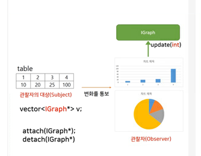
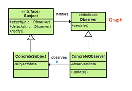

## Design Pattern part5

- Observer pattern
    - 관찰자(Observer)는 루프를 돌며 변화를 관찰 하거나
    - 관찰자의 대상(Subject)이 변화를 통보하는 방식
    - 객체 사이의 1:N의 종속성을 정의하고 
    - 한 객체의 상태가 변하면 다른 객체에 통보하며 자동으로 수정이 일어나게 한다.
    
    
    ```cpp
    #include <iostream>
    #include <vector>
    using namespace std;

    class Subject; // IGraph에서 사용하기 위한 전방 선언

    struct IGraph
    {
    public:
        virtual void update(Subject*) = 0;
        virtual ~IGraph() {}
    };

    struct Subject
    {
        vector<IGraph*> v;
    public:
        void attach(IGraph* p) { v.push_back(p); }
        void detach(IGraph* p) { /*TODO*/ }

        void notify()
        {
            for (auto p : v)
            {
                p->update(this);
            }
        }
    };

    class Table : public Subject
    {
        int data;
    public:
        int getData() { return data; }
        void setData(int d)
        {
            data = d;
            notify();
        }
    };

    class PieGraph : public IGraph
    {
    public:
        virtual void update(Subject* p)
        {
            // table에 접근하여 data를 가져온다.
            // p는 table의 인터페이스이므로 캐스팅 필요
            int n = static_cast<Table*>(p)->getData();
            Draw(n);
        }

        void Draw(int n)
        {
            cout << "Pie Graph: ";
            for (int i = 0; i < n; i++)
            {
                cout << "*";
            }
            cout << endl;
        }
    };

    class BarGraph : public IGraph
    {
    public:
        virtual void update(Subject* p)
        {
            int n = static_cast<Table*>(p)->getData();
            Draw(n);
        }

        void Draw(int n)
        {
            cout << "Bar Graph: ";
            for (int i = 0; i < n; i++)
            {
                cout << "*";
            }
            cout << endl;
        }
    };

    int main()
    {
        BarGraph bg;
        PieGraph pg;
        Table t;
        t.attach(&bg);
        t.attach(&pg);

        while (1)
        {
            int n;
            cin >> n;
            t.setData(n);
        }
    }
    ```

- Container 설계기술
    - Object(기반클래스) 포인터를 저장하는 컨테이너
        - 장점
            1. 코드 메모리가 증가하지 않는다.
        - 단점
            1. 타입 안정성이 떨어진다.
                > s.push_front(new Point);  
                > s.push_front(new Rect);  
                > // 타입이 달라도 같은 객체안에 push가 가능하다.
            2. 컨테이너에서 요소를 꺼낼 때 반드시 캐스팅이 필요하다.
                > Point* p = static_cast<Point*>(s.front());
            3. int, double 등의 primitive type은 저장할 수 없다.
            별도의 Integer등의 타입이 필요하다.
                > s.push_back(10) // error  
                > s.push_back(new Integer(10)); // ok

    - template 기반 컨테이너
        - 장점
            1. 타입 안정성이 뛰어나고
                > 다른 타입사용시 build error
            2. 컨테이너에서 요소를 꺼낼 때 캐스팅이 필요 없다.
            3. int, double등의 primitive type을 저장할 수 있다.
        - 단점
            1. 타입에 따라 코드가 생성 되므로 코드 메모리가 증가 한다.

    - thin template 기반 컨테이너
        - 템플릿에 의한 코드 중복을 줄이기 위한 기술
        - void* 등으로 내부 자료구조를 구성하고,
        - 캐스팅을 위한 템플릿을 제공한다.
        ```cpp
        template<typemane T> class slist : public slistImp
        {
        public:
            inline void push_front(T n) { slistTmp::push_front((void*)n); }
            inline T front() { return static_cast<T>(slistImp::front()); }
        }
        ```
        - [C++ idioms](https://en.wikibooks.org/wiki/More_C%2B%2B_Idioms)

- iterator pattern
    - container 자료구조에 상관없이 동일한 방법으로 각 요소에 순차적으로 접근 하는 것
    
    ```cpp
    /* GetObject : 반복자가 가리키는 곳에 있는 요소에 접근 하는 함수
       MoveNext  : 반복자 다음 요소로 이동하는 함수 */
    #include <iostream>
    using namespace std;

    template<typename T> struct Node
    {
        T   data;
        Node* next;
        Node( const T& d, Node* n) : data(d), next(n) {}
    };

    template<typename T> struct IEnumerator
    {
        virtual ~IEnumerator() {}
        virtual T& GetObject() = 0;
        virtual bool MoveNext() = 0;
    };

    template<typename T> class SlistEnumerator : public IEnumerator<T>  // container
    {
        Node<T>* current = 0;
    public:
        SlistEnumerator(Node<T>* p = 0) : current(p) {}

        virtual T& GetObject() { return current->data; }
        virtual bool MoveNext() 
        {
            current = current->next;
            return current;
        }
    };

    template<typename T> struct IEnumerable
    {
        virtual ~IEnumerable() {}
        virtual IEnumerator<T>* GetEnumerator() = 0;
    };
    template<typename T> class slist : public IEnumerable<T>
    {
        Node<T>* head = 0;
    public:
        virtual IEnumerator<T>* GetEnumerator()
        {
            return new SlistEnumerator<T>( head);
        }

        void push_front(const T& n) { head = new Node<T>(n, head);}
        T  front()                  { return head->data;}
    };

    template<typename T> void Show(IEnumerator<T>* p)
    {
        do
        {
            cout << p->GetObject() << endl; 
        } while ( p->MoveNext() );
    }

    int main()
    {
        int x[10] = {1,2,3,4,5,6,7,8,9,10};
        int* p1 = x;
        //Show( p1);    // error : 인터페이스 기반에서는 배열포인터를 인자로 사용할 수 없다.

        slist<int> s;

        s.push_front(10);
        s.push_front(20);
        s.push_front(30);
        s.push_front(40);

        IEnumerator<int>* p = s.GetEnumerator();

        Show( p );
        delete p;   //  new로 생성된 Enumerator 객체 삭제
    }
    ```
    - 인터페이스 기반 반복자 (C++ 관점에서 단점)
        - Show 함수에 배열을 전달 할 수 없다.
        - 반복자는 new를 만들어 진다. : 반드시 delete해야 한다.(smart pointer로 해결 가능)
        - 요소에 접근하고 이동하는 함수가 가상함수이다 : 오버헤드가 있다. (inline으로 대체 불가??)
    
    - STL 방식의 반복자
        > 인터페이스 방식을 보완한다.  
        - +*인터페이스를 사용하지 않는다.*  
        - +이동 및 접근 함수는 *포인터 규칙에* 따른다
            > -> ++로 이동, *fh 접근 (연산자 재정의)
        - +이동 및 접근 함수는 *inline함수*로 작성한다.
        - +배열에도 적용 가능하다.
        - -코드메모리 사용량이 인터페이스 기반보다는 많다.

        ```cpp   
        #include <iostream>
        using namespace std;

        template<typename T> struct Node
        {
            T   data;
            Node* next;
            Node( const T& d, Node* n) : data(d), next(n) {}
        };

        template<typename T> class slist_iterator   // container
        {
            Node<T>* current = 0;
        public:
            inline slist_iterator(Node<T>* p = 0) : current(p) {}

            inline T& operator*() { return current->data; } // p*
            slist_iterator& operator++()    // ++p 
            {
                current = current->next;
                return *this;
            }
        };

        template<typename T> class slist
        {
            Node<T>* head = 0;
        public:
            slist_iterator<T> begin()   // return값이 추상 클래스가 아니므로 값으로 리턴
            {
                return slist_iterator<T>(head);
            }

            void push_front(const T& n) { head = new Node<T>(n, head);}
            T  front()                  { return head->data;}
        };

        template<typename T> void Show(T p, T p2)   // 구간 끝을 조사하기 위해 반복자를 2개 받는다. p2는 마지막 다음 요소
        {
            do
            {
                cout << *p << endl; 
            } while ( ++p != p2 );
        }

        int main()
        {
            int x[10] = {1,2,3,4,5,6,7,8,9,10};
            int* p1 = x;
            Show(p1, x+10);    

            slist<int> s;

            s.push_front(10);
            s.push_front(20);
            s.push_front(30);
            s.push_front(40);

            slist_iterator<int> p = s.begin();
            cout << *p << endl; // 40
            ++p;
            cout << *p << endl; // 30
        }
        ```
- visitor pattern
    - 클래스를 변경하거나 멤버를 추가하지 않고 새로운 오퍼레이션을 정의 하는 방법
    - 캡슐화, 정보은닉은 위반하게 되는 경우도 생긴다.(e.g setTitle)
    - 모든 요소를 2배로 만드는 코드가 필요하다면?
        1. 외부에서 직접 연산 수행
        ```cpp
        list<int> s = { 1,2,3,4,5 };
        for (auto& n : s)
            n = n * 2;
        ```
        2. 멤버함수로 기능을 제공
        ```cpp
        list<int> s = { 1,2,3,4,5, };
        s.twice_all_element();
        s.show_all_element();
        ```
        3. 방문자 패턴을 사용
        ```cpp
        list<int> s = { 1,2,3,4,5 };
        TwiceVisitor<int> tv; // 방문자
        s.accept(&tv);
        ShowVisitor<int> sv; // 방문자
        s.accept(&sv);
        ```
    ```cpp
    #include <iostream>
    #include <list>

    using namespace std;

    // 방문자(visitor)의 인터페이스
    template<typename T> struct IVisitor
    {
        virtual void visitor(T& elem) = 0;
        virtual ~IVisitor() {}
    };

    template<typename T> class TwiceVisitor : public IVisitor<T>
    {
    public:
        virtual void visitor(T& elem) { elem = elem * 2; }
    };

    template<typename T> class ShowVisitor : public IVisitor<T>
    {
    public:
        virtual void visitor(T& elem) { cout << elem << endl; }
    };

    // 방문의 대상의 인터페이스
    template<typename T> struct IAcceptor
    {
        virtual void accept(IVisitor<T>* p) = 0;
        virtual ~IAcceptor() {}
    };

    template<typename T> class List : public list<T>, public IAcceptor<T>
    {
    public:
        using list<T>::list;    // c++11 생성자 상속
        virtual void accept(IVisitor<T>* p)
        {
            for (auto& e: *this)
                p->visitor(e);
        }
    };

    int main()
    {
    List<int> s = { 1,2,3,4,5,6,7,8,9,10};

    TwiceVisitor<int> tv;
    s.accept(&tv);

    ShowVisitor<int> sv;
    s.accept(&sv);
    }
    ```
    - 일반 객체 지향 프로그램 : 새로운 타입(클래스) 추가 쉬움 / 새로운 함수(기능) 추가 어려움
        > 새로운 클래스가 생겨도 기존 코드는 변경할 필요가 없다.  
        > 새로운 기능이 추가(기반클래스에 가상함수로 구현)되면 기존에 코드도 모두 추가 해야한다.
    - 방문자 패턴 프로그램    : 새로운 타입(클래스) 추가 어려움 / 새로운 함수(기능) 추가 쉬움
        > 새로운 기능이 추가 되면 새로운 visitor클래스가 추가될 뿐 기존의 visitor는 변경이 되지 않는다.  
        > 새로운 클래스가 추가(visitor 인터페이스에 가상함수에 추가)되면 기존 visitor에 모두 추가 되어야 한다.
    - 즉, 기반클래스(인터페이스)에 변경이 적은 구조로 설계해야 한다.
