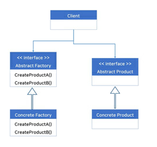
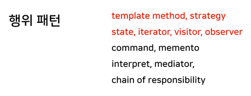
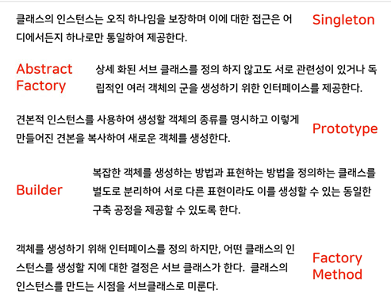
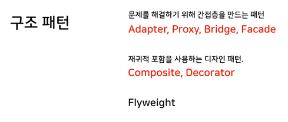

## Design Pattern part6

- 객체 생성 방법
    - 사용자가 직접 객체 생성
        - 객체 생성에 제약이 없으며 자유롭다.
        ```cpp
        class Shape
        {
        public:
            virtual ~Shape() {}
        };
        class Rect : public Shape
        {
        public:            
        };

        int main()
        {
            Rect r;              // stack
            Shape* p = new Rect; // heap
        }
        ```

    - static 멤버 함수를 사용한 객체 생성
        - 객체 생성을 한곳에서 수행하여 제약 조건을 만들 수 있다.
            > 생성 개수 제한, 자원 공유
        - 객체 생성 함수를 다른 함수의 인자로 전달 할 수 있다.
        ```cpp
        class Shape
        {
        public:
            virtual ~Shape() {}
        };

        class Rect : public Shape
        {
            Rect() {}   // 생성자를 private로 만들어 자유로운 객체 생성을 막는다.
        public:
        // static 함수로 만들어야 객체의 생성이 한곳에서 이루어지며 함수의 인자로 사용이 가능하다.
            static Shape* Create()
            {
                /* 이곳에 제약조건 추가 */ 
                return new Rect; 
            }
            void Draw() {}
        };

        void CreateAndDraw(Shape* (*f)())
        {
            Shape* p = f();
            p->Draw();
        }
        int main()
        {
            Shape* p = Rect::Create();
            CreateAndDraw(&Rect::Create());
        }
        ```
    - 객체 생성을 위한 전용 클래스
        - 객체 생성을 한곳에 집중 시키면서
        - 객체 본래의 기능과 객체 생성을 위한 코드를 분리한다.
        - 추상 팩토리(Abstract Factory) 패턴
        ```cpp
        class Shape
        {
        public:
            virtual ~Shape() {}
        };
        class Rect : public Shape
        {
            Rect() {}
        public:
            void Draw() {}
            friend class ShapeFactory
        };

        class ShapeFactory
        {
        public:
            Shape* CreateShape(int type)
            {
                Shape* p = 0;
                swich (type)
                {
                case 1: p = new Rect; break;
                //...
                }
                return p;
            }
        };

        int main()
        {
            ShapeFactory factory;
            Shape* p = factory.CreateShape(1);
        }
        ```
    
    - 기존에 존재하던 객체를 복사해서 새로운 객체 생성
        - prototype pattern
        - clone() 가상 함수
        ```cpp
        class Shape
        {
        public:
            virtual ~Shape() {}
            virtual Shape* clone() = 0;
        };
        class Rect : public Shape
        {
            Rect() {}
        public:
            void Draw() {}
            virtual Shape* clone() { return new Rect(*this); }
        };

        int main()
        {
            Shape* p = new Rect;
            Shape* p2 = p->clone();
        }
        ```

- Singleton pattern
    - 클래스의 인스턴스는 오직 하나임을 보장
    - 이에 대한 접근은 어디에서든지 하나로만 통일

    - 방법 1: static 멤버 data
    ```cpp
        class Cursor
    {
        int x, y;

    private:
        Cursor() {} // 생성자는 private로
        Cursor(const Cursor&) = delete; // 복사 생성자 삭제
        Cursor operator=(const Cursor&) = delete; // 복사 대입 생성자 삭제

        static Cursor instance;
    public:
        static Cursor getInstance()
        {
            return instance;
        }
    };

    Cursor Cursor::instance; // static 멤버변수의 외부 초기화로 인해 사용하지 않아도 항상 생성

    int main() { Cursor& c1 = Cursor::getInstance(); }
    ```
    - 방법2: static 지역 변수(Mayer's 싱글톤)
    ```cpp
    class Cursor
    {
        int x, y;

    private:
        Cursor() {} // 생성자는 private로
        Cursor(const Cursor&) = delete; // 복사 생성자 삭제
        Cursor operator=(const Cursor&) = delete; // 복사 대입 생성자 삭제
    public:
        static Cursor getInstance()
        {
            static Cursor instance; // static지역 변수 사용으로 사용하지 않으면 생성하지 않는다.(lazy initialization)
            return instance;
        }
    };
    int main() { Cursor& c1 = Cursor::getInstance(); }
    ```
    - 방법3: new로 생성
    ```cpp 
    class Cursor
    {
        int x, y;

    private:
        Cursor() {} // 생성자는 private로
        Cursor(const Cursor&) = delete; // 복사 생성자 삭제
        Cursor operator=(const Cursor&) = delete; // 복사 대입 생성자 삭제

        static Cursor* pInstance;
    public:
        static Cursor getInstance()
        {
            if (pInstance == 0)
                pInstance = new Cursor; // 멀티 스레드 프로그램에서 동기화 문제가 발생 된다.
            return *pInstance;
        }
    };

    Cursor* Cursor::pInstance = 0;

    int main() { Cursor& c1 = Cursor::getInstance(); }
    ```
    - DCLP(Double Check Locking Pattern)
        - new를 이용한 singleton pattern에서 동기화 문제는 lock을 사용하여 방지한다.
        - getInstance가 호출될 때 마다 lock이되는 것을 방지 하기위해 if문을 2번 사용하는 DCLP 기법을 사용한다.
        ```cpp
        static mutex m;
        static Cursor getInstance()
        {
            if(pInstance = 0)
            {
                m.lock();
                if (pInstance == 0)
                    pInstance = new Cursor; // 멀티 스레드 프로그램에서 동기화 문제가 발생 된다.
                    // Cursor의 생성 순서
                    //    1. temp = sizeof(Cursor)
                    //    2. Cursor::Cursor() 호출
                    //    3. pInstance = temp;
                    // 컴파일러의 최적화에 의해 pInstance = sizeof(Cursor)로 수행되면 
                    // 생성자가 호출 되기전에 다른 스레드에서 pInstance를 사용 할 가능성이 있다.
                    // atomic을 사용하여 문제를 해결한다.
                m.unlock();
            }

            return *pInstance;
        }
        ```

    - Singleton 코드의 재사용
        - 방법 1: 매크로를 사용
        ```cpp
        #define MAKE_SINGLETON(classname)                   \
        private:                                            \
            classname() { }                                 \
            classname(const classname&) = delete;           \
            void operator=(const classname&) = delete;      \
        public:                                             \
            static classname& getInstance()                 \
            {                                               \
                static classname instance;                  \
                return instance;                            \
            }

        class Cursor
        {
            int x, y;

            MAKE_SINGLETON(Cursor)
        };
        ```
        - 방법 2: 상속을 이용 : CRTP(Curiously Recurring Template Pattern)
        ```cpp
        template<typename TYPE> class Singleton
        {
        protected:
            Singleton() { }
            Singleton(const Singleton&) = delete;
            void operator=(const Singleton&) = delete;
        public:
            static TYPE& getInstance()
            {
                static TYPE instance;
                return instance;
            }
        };

        class Mouse : public Singleton<Mouse>
        {

        };
        ```
- Factory 
    - 일반적인 factory
    ```cpp
    class ShapeFactory
    {
        MAKE_SINGLETON(ShapeFactory)
    public:
        Shape* CreateShape(int type )
        {
            Shape* p = 0;
            if      ( type == 1 ) p = new Rect;
            else if ( type == 2 ) p = new Circle;

            return p;
        }
    };

    int main() 
    {
        ShapeFactory& factory = ShapeFactory::getInstance();
        Shape* p = factory.CreateShape(1);
    }
    ```
    - 제품 등록형 factory : 사용자가 제품을 공장에 직접 등록
    ```cpp
    class ShapeFactory
    {
        MAKE_SINGLETON(ShapeFactory)
        typedef Shape* (*CREATOR)();
        map<int, CREATOR> create_map;

    public:
        void Register( int type, CREATOR f )
        {
            create_map[type] = f;
        }

        Shape* CreateShape(int type )
        {
            Shape* p = 0;
            auto ret = create_map.find( type );
            if ( ret == create_map.end() )
                return 0;
            p = create_map[type]();

            return p;
        }
    };
    
    int main()
    {
        ShapeFactory& factory = ShapeFactory::getInstance();

        // 공장에 제품을 등록한다.
        factory.Register( 1, &Rect::Create);
        factory.Register( 2, &Circle::Create);

        //factory.ShowProduct();
        vector<Shape*> v;

        Shape* p = factory.CreateShape(1);
        if (p != 0)
            v.push_back(p)
    }
    ```
    - 제품 자동 등록형 factory : 제품(class)을 정의와 동시에 공장에 등록 된다.
    ```cpp
    struct RegisterShape
    {
        RegisterShape( int type, Shape*(*f)() )
        {
            ShapeFactory& factory = ShapeFactory::getInstance();
            factory.Register(type, f);
        }
    };

    class Rect : public Shape
    {
    public:
        virtual void Draw() { cout << "Draw Rect" << endl;}

        static Shape* Create() { return new Rect;}
        static RegisterShape rs;
    };
    RegisterShape Rect::rs( 1, &Rect::Create);

    // 모든 도형이 지켜야 하는 규칙을 매크로로 제공
    #define DECLARE_SHAPE( classname )                  \
        static Shape* Create() { return new classname;}      \
        static RegisterShape rs;

    #define IMPLEMENT_SHAPE( type, classname )                \
        RegisterShape classname::rs(type, &classname::Create);

    class Circle : public Shape
    {
    public:
        virtual void Draw() { cout << "Circle Rect" << endl;}

        DECLARE_SHAPE( Circle )
    };
    IMPLEMENT_SHAPE( 2, Circle )
    ```
    
    - 클래스가 아닌 객체를 등록하는 factory
        - 자주 사용하는 견본품을 등록해서 복사 생성 한다.
        - prototype 패턴이라고 한다.
    ```cpp
    class ShapeFactory
    {
        MAKE_SINGLETON(ShapeFactory)
        map<int, Shape*> protype_map;

    public:
        void Register( int type, Shape* sample )
        {
            protype_map[type] = sample;
        }

        Shape* CreateShape(int type )
        {
            Shape* p = 0;
            auto ret = protype_map.find( type );
            if ( ret == protype_map.end() )
                return 0;

            p = protype_map[type]->Clone();

            return p;
        }
    };

    int main()
    {
        ShapeFactory& factory = ShapeFactory::getInstance();

        Rect* r1 = new Rect;// 빨간색 크기 5
        Rect* r2 = new Rect;// 파란색 크기 10

        // 공장에 객체 등록
        factory.Register( 1, r1);
        factory.Register( 2, r2);
        vector<Shape*> v;
        Shape* p = factory.CreateShape(cmd);
        if ( p != 0 )
            v.push_back( p );
    }
    ```

- Abstract factory
    - 여러 객체의 군(Button, Edit)을 생성하기 위한 인터페이스를 제공한다.  
    
    ```cpp
    #include <iostream>
    #include <string.h>
    using namespace std;

    struct IEdit
    {
        virtual void Draw() = 0;
        virtual ~IEdit() {}
    };
    struct IButton
    {
        virtual void Draw() = 0;
        virtual ~IButton() {}
    };

    struct WinButton : public IButton { void Draw() { cout << "Draw WinButton" << endl;}};
    struct GTKButton : public IButton { void Draw() { cout << "Draw GTKButton" << endl;}};

    struct WinEdit : public IEdit { void Draw() { cout << "Draw WinEdit" << endl;}};
    struct GTKEdit : public IEdit { void Draw() { cout << "Draw GTKEdit" << endl;}};

    struct IFactory // abstract factory
    {
        virtual IButton* CreateButton() = 0;
        virtual IEdit* CreateEdit() = 0;
        virtual ~IFactory() {}
    };

    struct WinFactory : public IFactory
    {
        IButton* CreateButton() { return new WinButton; }
        IEdit* CreateEdit() { return new WinEdit; }
    };

    struct GTKFactory : public IFactory
    {
        IButton* CreateButton() { return new GTKButton; }
        IEdit* CreateEdit() { return new GTKEdit; }
    };

    int main(int argv, char** argc)
    {
        IFactory* pFactory;
        if ( strcmp(argc[1], "Windows") == 0)
            pFactory = new WinFactory;
        else
            pFactory = new GTKFactory;

        IButton* pBtn = pFactory->CreateButton();
        pBtn->Draw();
    }
    ```
- Factory method
    - template method와 유사한 형태 (형태는 같지만 가상함수로 뽑아낸 부분이 객체의 생성을 담당하는 경우 factory method라고 부름)
    - 객체 생성의 인터페이스는 정의 하고 있지만, 어떤 클래스의 인스턴스를 생성할지는 서브 클래스가 하는 방식
    - 즉, 클래스의 인스턴스를 만드는 시점을 서브 클래스로 미루는 것
    ```cpp
    class BaseDialog
    {
    public:
        void init()
        {
            IButton* pBtn = CreateButton();
            IEdit* pEdit = CreateEdit();
            
            pBtn->Draw();
            pEdit->Draw();
        }
        virtual IButton* CreateButton() = 0;    // 인터페이스만 정의 
        virtual IEdit* CreateEdit() = 0;        // 인터페이스만 정의
    };

    // 어떤 인스턴스를 생성할지는 서브 클래스에서 결정
    struct WinDialog : public BaseDialog
    {
        virtual IButton* CreateButton() { return new WinButton; }
        virtual IEdit* CreateEdit() { return new WinEdit; }
    };

    struct GTKDialog : public BaseDialog
    {
        virtual IButton* CreateButton() { return new GTKButton; }
        virtual IEdit* CreateEdit() { return new GTKEdit; }
    };
    ```
    
- Builder pattern
    - 객체를 생성하는 방법(makexxx)과 표현하는 방법(XML, Text)을 정의하는 클래스를 별도로 분리
    - 전략 패턴, 상태 패턴 과 흡사
        > 전략 패턴은 알고리즘을 변경할 때 VS 상태 패턴은 동작을 변경할 때 VS 빌더 패턴은 객체를 만들 때
    ```cpp
    #include <iostream>
    #include <string>
    using namespace std;

    // 입학 지원서
    using Application = string; // class Application {}

    // 객체의 표현을 생성하는 인터페이스
    struct IBuilder
    {
        virtual void makeName(string name) = 0;
        virtual void makePhone(string phone) = 0;
        virtual void makeAddress(string addr) = 0;
        
        virtual Application getResult() = 0;
        
        virtual ~IBuilder() {}
    };

    // 지원서 만드는 클래스
    class Director
    {
        string name = "HONG";
        string phone = "010-111-1111";
        string address = "SEOUL KANGNAMGU";
        IBuilder* pBuilder;
    public:
        void setBuilder(IBuilder* p) { pBuilder = p; }
        
        Application construct()
        {
            pBuilder->makeName(name);
            pBuilder->makePhone(phone);
            pBuilder->makeAddress(address);
            
            return pBuilder->getResult();
        }
    };

    class XMLBuilder : public IBuilder
    {
        Application app;
    public:
        virtual void makeName(string name)
        {
            app += "<NAME>" + name + "</NAME>\n";
        }
        virtual void makePhone(string phone)
        {
            app += "<PHONE>" + phone + "</PHONE>\n";
        }
        virtual void makeAddress(string addr)
        {
            app += "<ADDRESS>" + addr + "</ADDRESS>\n";
        }

        virtual Application getResult() { return app;}
    };

    class TextBuilder : public IBuilder
    {
        Application app;
    public:
        virtual void makeName(string name)
        {
            app += name + "\n";
        }
        virtual void makePhone(string phone)
        {
            app += phone + "\n";
        }
        virtual void makeAddress(string addr)
        {
            app +=  addr + "\n";
        }

        virtual Application getResult() { return app;}
    };

    int main()
    {
        Director d;
        XMLBuilder xb;
        d.setBuilder(&xb);

        Application app = d.construct();
        cout << app << endl;
        
        TextBuilder tb;
        d.setBuilder(&tb);
        app = d.construct();
        cout << app << endl;
    }
    ```
- GoF의 디자인 패턴 종류
    - 행위 패턴
    
    - 생성 패턴
    
    - 구조 패턴
    
    
